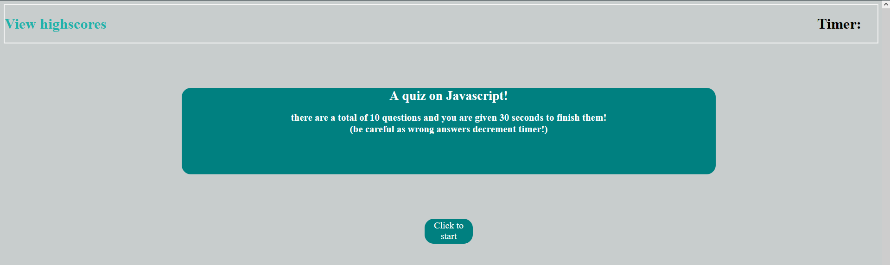
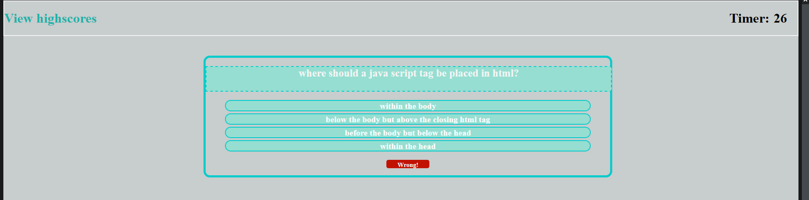
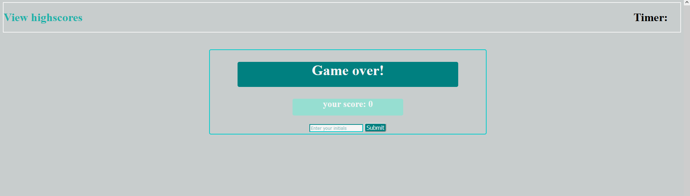
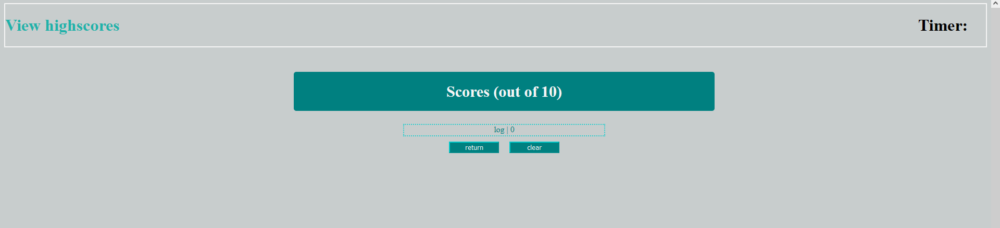

<JAVASCRIPT-QUIZ>

# Javascript quiz

## Description:

a quiz for javascript that can store previous scores

## 1.Installation:

Can just clone the repo code and fiddle as you want( if you do please give credit where its due).

## 2.Usage:

A basic quiz for javascript. Thats pretty much it. All you have to do is press start and you will be prompted with a multiple choice question.

## 3.Credits:

Malik Kouyate.
